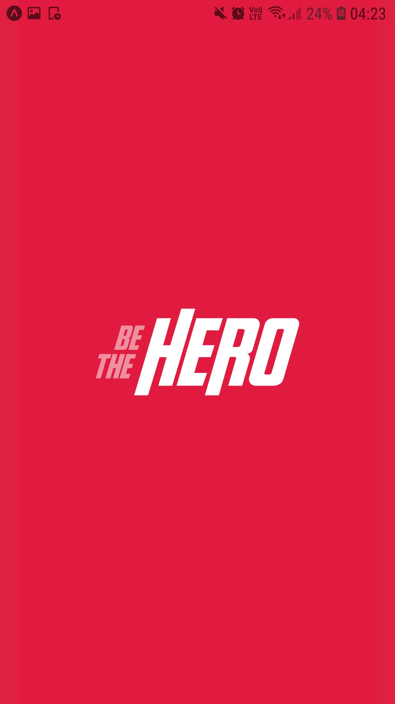
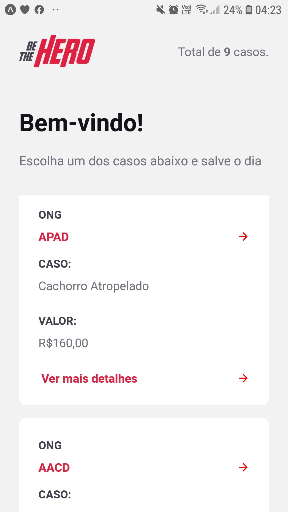
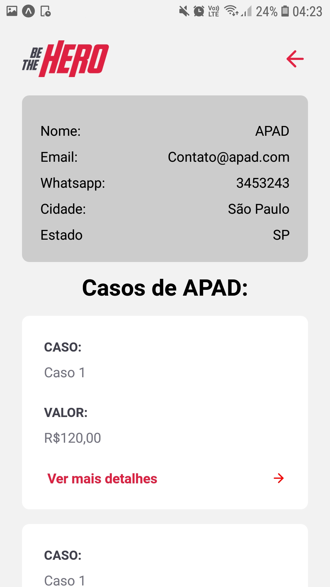
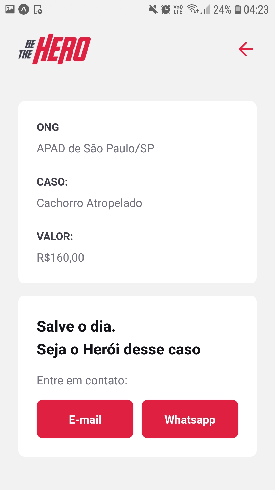

# Project Be the Hero Omnistack 11
Be the hero is an multiple platform system(mobile,web) that lets NGO's register multiple help-needed cases.

## Tecnologies used :zap:
- Expo with react native for mobile
- Node for backend
- react-js for front web

All the dependencies for npm are in their respective package.json file

## Instalation guide :bust_in_silhouette:
- You just need to access the three main folders ('frontend'), ('backend') and ('mobile') and then execute the command below(this command will install the dependencies in the package.json file):
```
cd frontend
```
or
```
cd backend
```
or

```
cd mobile
```
and then
```
npm install
```
## Running the application in dev-mode :computer:

- To run the aplication you just need to do the follow:
```
cd backend
```
and
```
cd frontend
```
and then inside these folders just do:
```
npm start
```
and finally:
```
cd mobile
```
then:
```
expo start
```
This way you can just scan the expo QRCode into your cel and voa-la!


# Be the hero :boom:
Screenshots..!

## App

<div style="display:flex;">


</div>
<div style="display:flex">


</div>


